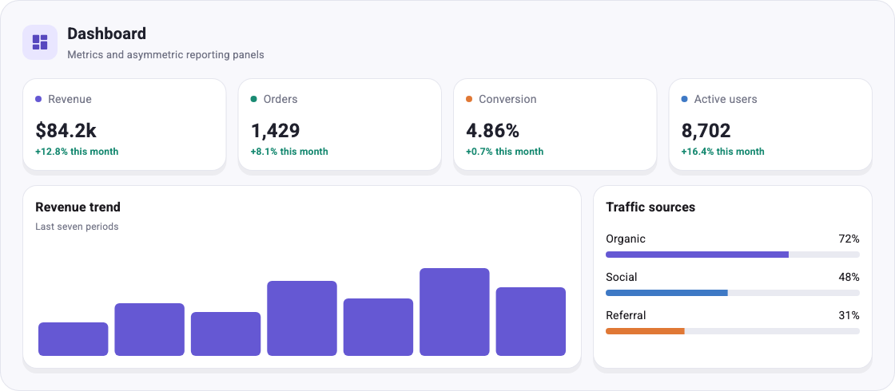
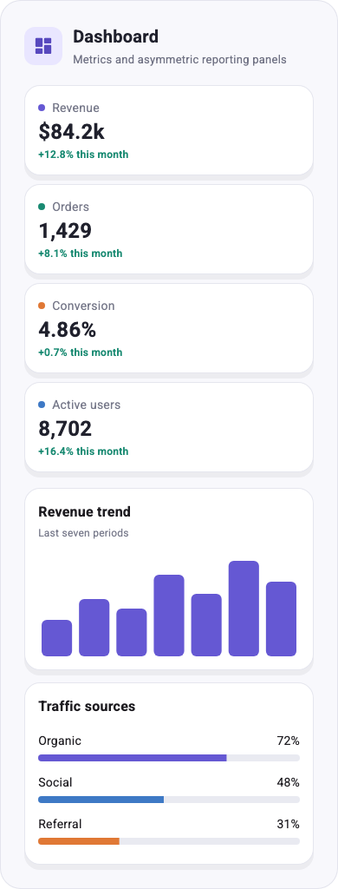
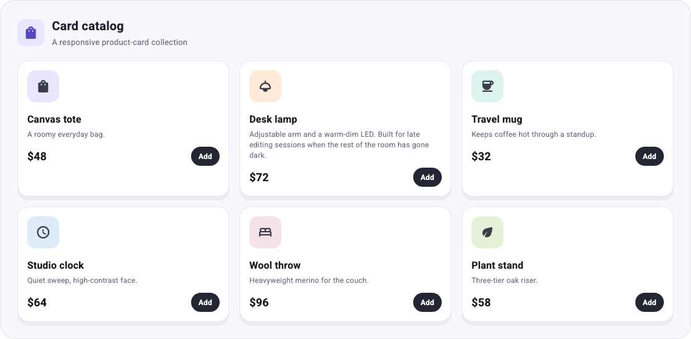
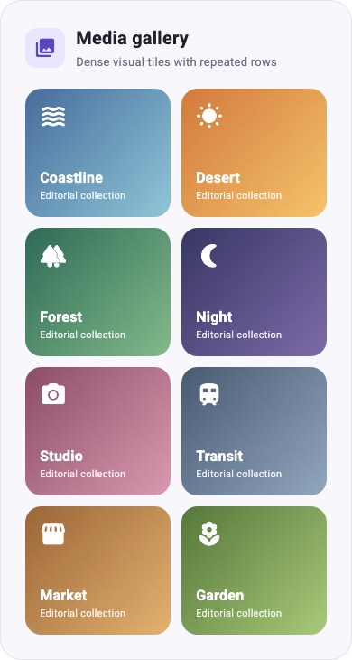
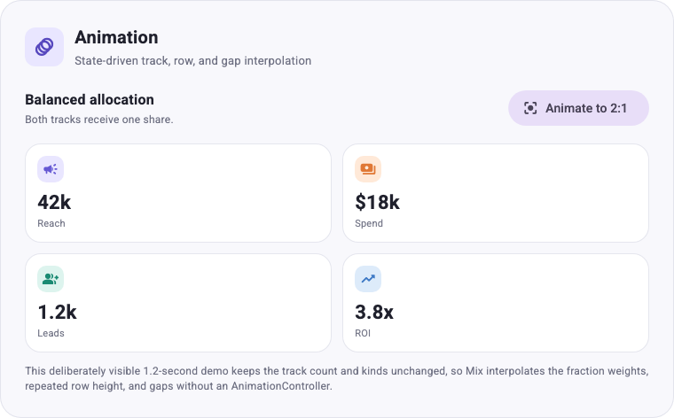
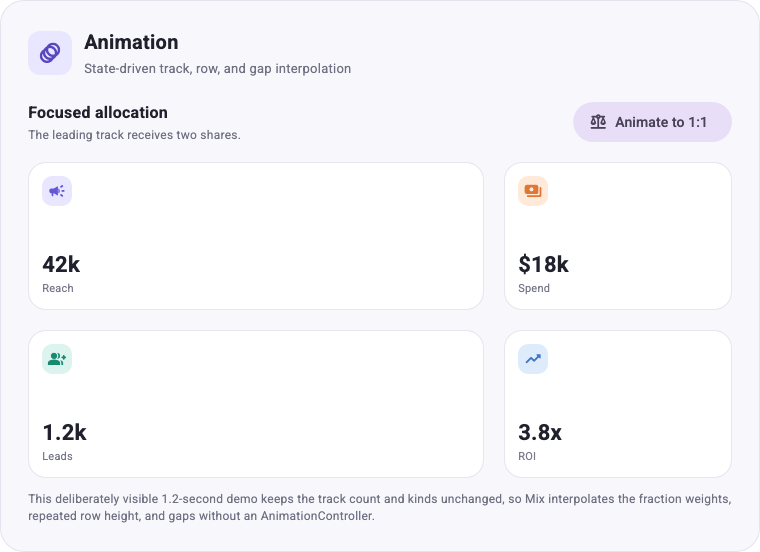

# Mix Layouts

These galleries consume Mix's public `package:mix/mix.dart` library. From
`examples/showcase`, run the combined app. The home page keeps static
screenshots. Open a layout card — or choose **Layouts**, then one primitive —
to get that example alone, with its Mix code beside it. Desktop shows the
preview and code side by side; narrower windows stack them. The visible code
starts at the widget and leaves out the app shell. **Copy code** copies the
complete runnable file.

```sh
fvm flutter run -d chrome
```

GridBox's showcase example offers Compact, Medium, and Wide widths so
`onConstraints` can select one, two, or four columns, plus a content control
that swaps short metrics for unequal notes. FlexBox switches direction and
content. WrapBox changes the offered width and the length of each child.

The standalone GridBox and WrapBox hosts below remain the deeper galleries
used by golden tests. They are separate entry points, not a second catalog
inside the showcase.

```sh
fvm flutter run -d chrome -t lib/layouts/grid/main.dart
```

Open WrapBox directly:

```sh
fvm flutter run -d chrome -t lib/layouts/wrap/main.dart
```

For bite-sized interaction demos, see [Snacks](snacks.md). For local overrides,
published dependencies, and deployment, see [app setup](../README.md).

## GridBox

The Grid gallery switches between compact, medium, and wide parent widths. Its
styles use `onConstraints`, so each Grid responds to its own offered space
rather than the viewport:

```dart
final GridBoxStyler cardGrid = .equalColumns(3)
    .gap(16)
    .onConstraints(
  .maxWidth(760),
  .equalColumns(2).gap(12),
).onConstraints(
  .maxWidth(520),
  .equalColumns(1).gap(10),
);

GridBox(style: cardGrid, children: cards);
```

The dashboard composes two independent GridBoxes: metrics transition from four
to two to one column, while the asymmetric report panels transition from two
columns to one.

<p>
  
  
</p>

The card catalog omits `autoRows` so implicit rows size to unequal copy. The
media gallery keeps fixed automatic rows for a dense, even tile height:

<p>
  
  
</p>

### Grid animation

The Animation example toggles a two-column planning Grid between balanced and
focused geometry. Rebuilding the same two fractional tracks lets Mix
interpolate their weights from 1:1 to 2:1 while also animating the repeated row
height and gaps. The gallery deliberately uses 1.2 seconds so the interpolation
is easy to inspect; product transitions can be shorter:


```dart
final GridBoxStyler animatedGrid = .columns([
  .fr(focused ? 2 : 1),
  .fr(1),
])
    .autoRows(.fixed(focused ? 148 : 112))
    .gap(focused ? 20 : 12)
    .animate(.easeInOut(const Duration(milliseconds: 1200)));
```

No `AnimationController` is needed. Track lists with different lengths or
kinds switch at the midpoint instead, and `onConstraints` branch selection
remains immediate because it happens during layout.

<p>
  
  
</p>

## WrapBox

The primary example uses WrapBoxStyler's flattened fluent methods:

```dart
final style = WrapBoxStyler()
    .padding(.all(16))
    .spacing(8)
    .runSpacing(10)
    .wrapAlignment(WrapAlignment.center);
```

For advanced composition, `.flow(WrapStyler(...))` replaces or merges the
nested Wrap style directly. The name is `flow` because `.wrap()` is the Mix
widget-modifier API. On WrapBoxStyler, `.alignment()` and `.clipBehavior()`
belong to the outer Box; `.wrapAlignment()` and `.wrapClipBehavior()` belong
to Flutter's inner Wrap.

The widget tests include smoke coverage and deterministic responsive golden
images for WrapBox and GridBox, plus navigation coverage for the Layouts section:

```sh
fvm flutter test
```
